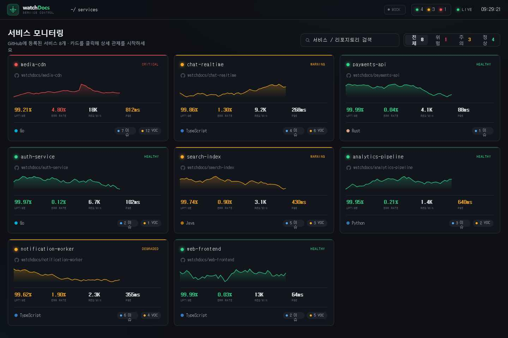

# watchDocs

> GitHub에 등록한 여러 서비스의 상태를 한 화면에서 관제하는 대시보드.
> 서버 부하 · 에러/장애 · 사용자 애로사항(VOC) · API 호출량 · Uptime · 배포 현황을 서비스별로 모니터링합니다.

다크 콘솔(관제실) 톤의 대시보드 + 서비스들의 신호를 모으는 수집기(Collector)로 구성됩니다.
**서비스마다 표준 `GET /telemetry` 한 가지만 지키면** 카드에 자동으로 나타납니다 — 언어/프레임워크 무관.



---

## 목차
1. [동작 구조](#동작-구조)
2. [빠른 시작 (Docker)](#빠른-시작-docker)
3. [서비스 연결하기](#서비스-연결하기) ← **핵심**
   - [방법 A. Node/Express 미들웨어](#방법-a--nodeexpress-미들웨어-한-줄)
   - [방법 B. 다른 언어 (Go/Python/Rust/Java…)](#방법-b--다른-언어-gopythonrustjava)
   - [방법 C. Push (워커/배치/람다)](#방법-c--push-워커배치람다)
4. [GitHub 데이터 연동 (이슈·커밋)](#github-데이터-연동-이슈커밋)
5. [표준 Telemetry 계약](#표준-telemetry-계약)
6. [프로젝트 구조](#프로젝트-구조)
7. [환경변수](#환경변수)
8. [FAQ](#faq)

---

## 동작 구조

```
 ┌──────────────┐   GET /telemetry    ┌───────────────┐   GET /api/snapshot   ┌──────────────┐
 │  각 서비스    │ ──(표준 JSON)────▶ │   Collector    │ ───────────────────▶ │   대시보드     │
 │ media-cdn 등 │                     │  (폴링/수집)   │                       │  (nginx)     │
 └──────────────┘                     └───────────────┘                       └──────────────┘
        ▲  POST /ingest/:id (push 방식도 가능)         registry.json = 등록된 서비스 목록
```

- **Collector**: `registry.json`에 등록된 서비스들을 주기적으로 폴링(기본 5초)하거나, push로 들어온 신호를 받아 하나의 스냅샷으로 합칩니다.
- **대시보드**: `/api/snapshot` 하나만 읽습니다. 수집기가 없으면 자동으로 번들된 목업으로 폴백하므로 단독으로도 동작합니다.
- 상단 우측 배지 **`API`**(수집기 연결) / **`MOCK`**(폴백)로 데이터 출처를 표시합니다.

---

## 빠른 시작 (Docker)

```bash
docker compose up --build
```

| | 주소 |
|---|---|
| 대시보드 | http://localhost:8080 |
| 수집기 헬스 | http://localhost:4000/healthz |

`registry.json`의 서비스가 모두 `demo: true` 라서 **외부 서비스 없이도 실시간으로 움직이는 데이터**가 보입니다. 실제 서비스를 붙이려면 아래로.

> 대시보드만 띄우려면: `docker build -t watchdocs-dashboard . && docker run -p 8080:80 watchdocs-dashboard` (수집기 미연결 시 목업 폴백)

---

## 서비스 연결하기

연결의 핵심은 **표준 `GET /telemetry` 응답 하나**입니다. 필수 필드는 `service.id` 와 `health.status` 둘뿐, 나머지는 채울 수 있는 만큼만 채우면 됩니다. (전체 스키마: [API.md](API.md))

연결한 뒤에는 항상 **2단계**가 공통입니다:

```jsonc
// 1) server/registry.json 에 한 줄 추가
{ "id": "media-cdn", "repo": "watchdocs/media-cdn",
  "telemetryUrl": "http://media-cdn:8080/telemetry", "demo": false }
```
```bash
# 2) 수집기 핫리로드 (재시작 없이)
curl -X POST http://localhost:4000/admin/reload
```
> 같은 Docker 네트워크라면 `telemetryUrl`에 컨테이너/서비스명을 그대로 씁니다 (예: `http://media-cdn:8080/telemetry`).

### 방법 A · Node/Express 미들웨어 한 줄

```js
const { watchdocsAgent } = require("./agent/watchdocs-agent");

app.use(watchdocsAgent({
  service: {
    id: "media-cdn",                  // registry.json의 id와 동일
    title: "Media CDN",
    repo: "watchdocs/media-cdn",
    lang: "JavaScript",
    version: process.env.APP_VERSION,
  },
}));
```
미들웨어가 **요청수 · 에러율(5xx) · 지연 P95 · CPU/메모리**를 자동 측정합니다.
`disk` · `net` · `activeUsers` 는 옵션으로 주입하세요. → [agent/README.md](agent/README.md)

### 방법 B · 다른 언어 (Go/Python/Rust/Java…)

미들웨어가 없어도 됩니다. `GET /telemetry` 가 [API.md](API.md)의 JSON을 그대로 반환하면 끝입니다.

```jsonc
// 최소 예시 — 필수 두 필드만
{ "service": { "id": "search-index" }, "health": { "status": "warning" } }
```
값을 더 채울수록 카드/상세가 풍부해집니다 (`metrics`, `series`, `errors`, `feedback`, `deploys`).

### 방법 C · Push (워커/배치/람다)

엔드포인트를 상시 열 수 없는 서비스는 같은 JSON을 수집기로 보냅니다:

```bash
curl -X POST http://localhost:4000/ingest/my-worker \
  -H "Content-Type: application/json" \
  -d '{ "service": { "id": "my-worker", "repo": "watchdocs/my-worker" }, "health": { "status": "healthy" } }'
```
처음 보는 `id`는 **자동 등록**되어 카드에 나타납니다.

---

## GitHub 데이터 연동 (이슈·커밋)

"사용자 애로사항(VOC)"과 "배포/커밋"은 GitHub API에서 채울 수 있습니다. agent의 훅에 연결하면 됩니다 (토큰만 꽂으면 동작):

```js
app.use(watchdocsAgent({
  service: { id: "media-cdn", repo: "watchdocs/media-cdn" },

  // 오픈 이슈 → 사용자 애로사항
  collectFeedback: async () => {
    const r = await fetch("https://api.github.com/repos/watchdocs/media-cdn/issues?state=open&per_page=10",
      { headers: { Authorization: `Bearer ${process.env.GH_TOKEN}` } });
    return (await r.json()).filter(i => !i.pull_request).map(i => ({
      type: "issue", sev: "med", title: i.title, author: i.user.login,
      channel: `GitHub #${i.number}`, up: i.reactions?.total_count || 0,
      time: new Date(i.created_at).getTime(), tag: i.labels[0]?.name || "bug",
    }));
  },

  // 최근 커밋 → 배포/커밋 타임라인
  collectDeploys: async () => {
    const r = await fetch("https://api.github.com/repos/watchdocs/media-cdn/commits?per_page=5",
      { headers: { Authorization: `Bearer ${process.env.GH_TOKEN}` } });
    return (await r.json()).map(c => ({
      kind: "commit", sha: c.sha.slice(0,7), msg: c.commit.message.split("\n")[0],
      author: c.commit.author.name, time: new Date(c.commit.author.date).getTime(), state: "ok",
    }));
  },
}));
```
전체 매핑 예시는 [agent/README.md](agent/README.md) 참고.

---

## 표준 Telemetry 계약

서비스가 내보내는 신호의 전체 형태(요약):

```jsonc
{
  "schema": "watchdocs/telemetry@1",
  "service": { "id", "name", "title", "repo", "lang", "env", "region", "version", "versionState" },
  "health":  { "status", "score", "uptime", "uptime30" },
  "metrics": { "reqPerMin", "apiCalls24h", "errorRate", "latencyP95", "activeUsers", "cpu", "mem", "disk", "net" },
  "series":  { "req": [], "err": [], "lat": [], "cpu": [] },
  "errors":   [ { "sev", "code", "title", "count", "delta", "lastSeen", "endpoint", "trace" } ],
  "feedback": [ { "type", "sev", "title", "author", "channel", "up", "time", "tag" } ],
  "deploys":  [ { "kind", "sha", "msg", "author", "time", "state" } ]
}
```
필드별 타입·허용값은 **[API.md](API.md)** 에 정리되어 있습니다.

수집기가 대시보드에 제공하는 API:

| 메서드 | 경로 | 설명 |
|--------|------|------|
| `GET`  | `/api/snapshot` | 전체 합본 (대시보드 메인) |
| `GET`  | `/api/services` | 서비스 요약 배열 |
| `GET`  | `/api/services/:id` | 단일 서비스 상세 |
| `POST` | `/ingest/:id` | push 방식 신호 수신 |
| `POST` | `/admin/reload` | registry 핫리로드 |
| `GET`  | `/healthz` | 수집기 자체 헬스 |

---

## 프로젝트 구조

```
.
├── watchDocs Dashboard.html   # 대시보드 진입 (nginx가 index.html로 서빙)
├── data.js                    # 단독 실행용 번들 목업 (폴백)
├── api.js                     # 데이터 어댑터: /api/snapshot ↔ 목업 폴백
├── components.jsx             # 차트·패널 등 공통 UI
├── grid.jsx                   # 서비스 카드 그리드 (선택 GUI)
├── detail.jsx                 # 상세 모니터링 화면
├── app.jsx                    # 앱 셸 · 라이브 틱 · Tweaks
│
├── server/                    # ── Collector (수집기) ──
│   ├── collector.js           #   폴링/수집 + 대시보드 API
│   ├── synth.js               #   데모 telemetry 생성기 (demo:true용)
│   ├── registry.json          #   등록된 서비스 목록 ★여기에 추가
│   ├── package.json
│   └── Dockerfile
│
├── agent/                     # ── 서비스에 붙이는 reference ──
│   ├── watchdocs-agent.js     #   Express 미들웨어
│   └── README.md              #   언어별 연결 가이드
│
├── docker/nginx.conf          # 정적 서빙 + /api 프록시
├── Dockerfile                 # 대시보드 이미지
├── docker-compose.yml         # collector + dashboard
├── API.md                     # 표준 telemetry 계약 스펙
└── DOCKER.md                  # Docker 실행 상세
```

---

## 환경변수

| 변수 (collector) | 기본값 | 설명 |
|------------------|--------|------|
| `PORT` | 4000 | 수집기 포트 |
| `POLL_MS` | 5000 | 서비스 폴링 주기(ms) |
| `FETCH_TIMEOUT_MS` | 3000 | telemetry fetch 타임아웃(ms) |
| `REGISTRY_PATH` | ./registry.json | 레지스트리 경로 |

대시보드가 다른 호스트의 수집기를 봐야 하면 `<body data-api-base="https://collector.example.com">` 로 지정할 수 있습니다.

---

## FAQ

**Q. 서비스가 죽으면?**
수집기가 폴링에 실패하면 해당 카드는 `CRITICAL` + `UNREACHABLE` 에러로 표시됩니다.

**Q. 수집기 없이 대시보드만 봐도 되나요?**
네. `/api`가 응답하지 않으면 번들된 목업으로 자동 폴백합니다 (배지가 `MOCK`).

**Q. 서비스가 많아지면?**
`registry.json`에 계속 추가하면 됩니다. 폴링은 병렬로 처리됩니다. 수가 아주 많아지면 `POLL_MS`를 늘리거나 push 방식으로 전환을 권장합니다.

**Q. 인증은?**
현재 수집기 API는 인증이 없습니다. 운영에선 내부망에 두거나 리버스 프록시에서 인증/허용 IP를 거는 것을 권장합니다.

---

## 라이선스
사내/개인 프로젝트 용도. 필요에 맞게 수정해서 사용하세요.
